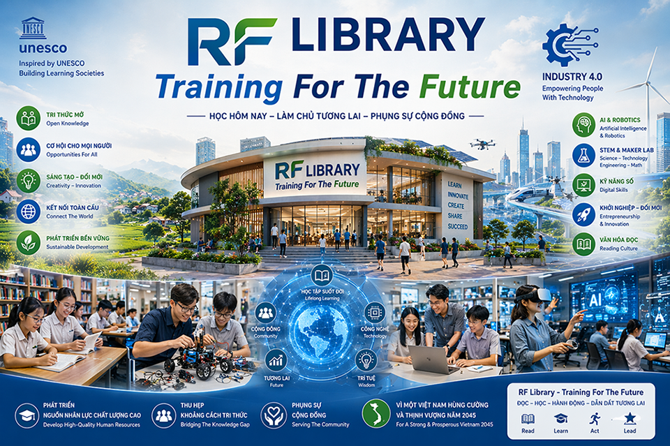
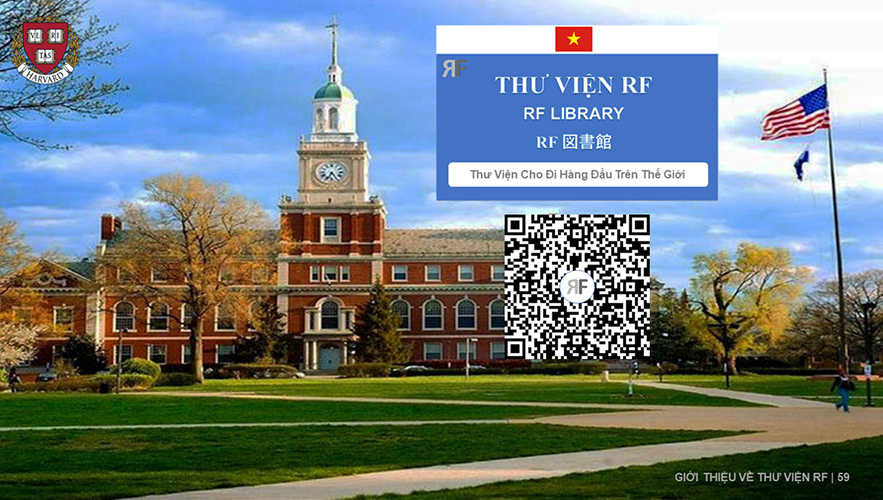
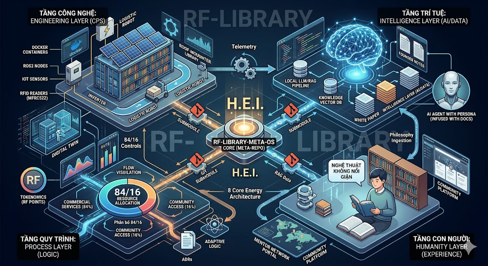
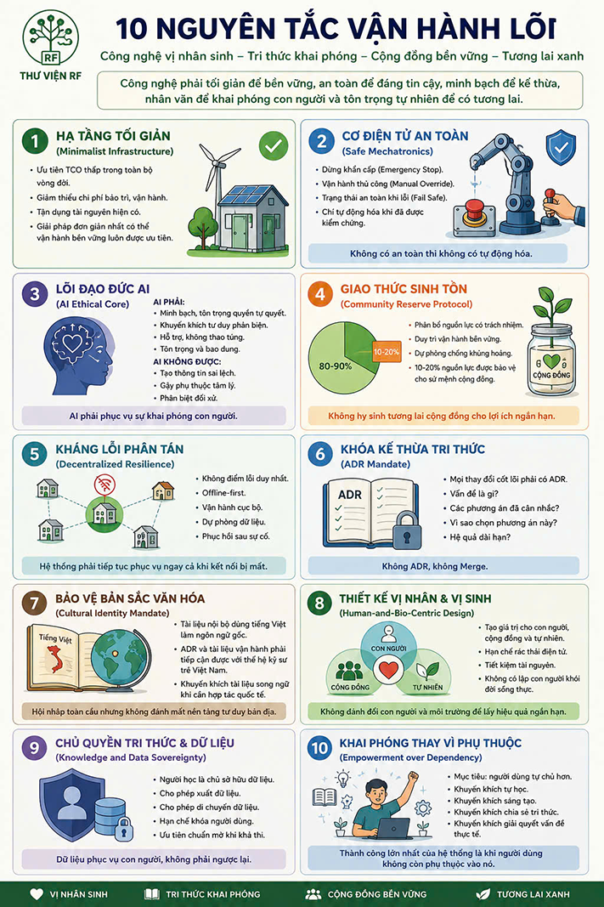
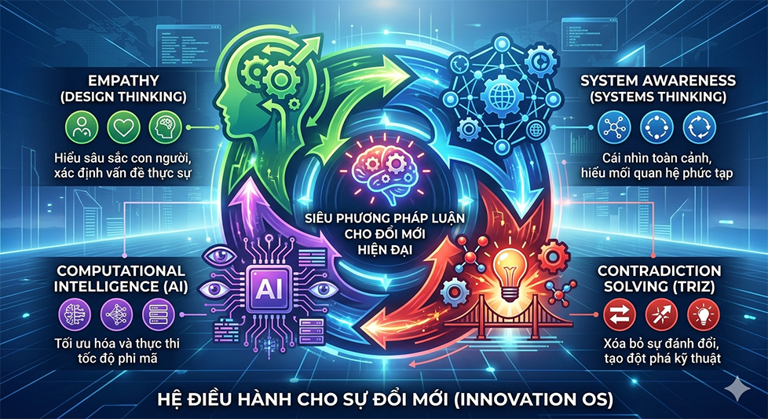

# 📚 RF-LIBRARY-META-OS

> ⚠️ **TRẠNG THÁI DỰ ÁN: PHIÊN BẢN THỬ NGHIỆM (BETA) - CHƯA PHÁT HÀNH CHÍNH THỨC**
> *Hệ điều hành Meta-OS hiện đang trong giai đoạn xây dựng kiến trúc lõi (Macro-Architecture) và thử nghiệm giao thức sinh tồn (Proof of Concept). Các phân hệ (Submodules) đang trong quá trình lắp ráp và cấu trúc có thể thay đổi liên tục trước khi đạt bản Release v1.0.0. Hiện tại chưa khuyến nghị triển khai vào môi trường thực tế (Production). Mọi đóng góp mã nguồn (Pull Requests) và ý tưởng kiến trúc ở giai đoạn này đều được chào đón!*

---

## 📚 RF-LIBRARY-META-OS

> **"Freedom Library - Training For The Future!"**

Được thành lập vào ngày 25/12/2020, Thư viện RF là một Hệ sinh thái Đào tạo Phi lợi nhuận vận hành dưới dạng một Meta-Repository. Nơi đây không chỉ lưu trữ mã nguồn, mà còn chứa đựng khát vọng bẻ cong "tam giác giáo dục truyền thống" (chi phí – chất lượng – quy mô), tạo ra một môi trường học tập tự chủ, bền vững và nhân văn.

Triết lý tối thượng của chúng tôi: **“Cho ham muốn câu cá chứ không cho cá"**.

**RF-LIBRARY-META-OS** là kho lưu trữ tổng (Meta-Repository) điều phối toàn bộ hệ thống phần cứng, trí tuệ nhân tạo và quy trình vận hành của Thư viện Thông minh RF. 

> **"Mọi hệ thống đều chết khi mất khả năng kiến tạo, hấp thụ hoặc tái tạo năng lượng. RF Library là một thực thể sống."**

---

## 🌍 Tuyên Ngôn: Lời Giải Cho Thách Thức Thời Đại

Thư viện RF ra đời như một phòng tuyến tri thức và công nghệ nhằm đối mặt với các khủng hoảng mang tính cấu trúc:
* **Bất bình đẳng tri thức:** Xóa bỏ khoảng cách tài nguyên giáo dục ở các vùng khó khăn.
* **Chủ quyền dữ liệu:** Giải quyết nguy cơ phụ thuộc công nghệ nước ngoài bằng hệ thống Edge AI nội bộ độc lập.
* **Bẫy thu nhập trung bình:** Tạo động lực vươn lên thông qua việc đào tạo công nghệ cao cốt lõi ngay từ đầu.
* **Biến đổi khí hậu:** Đối phó với sự dịch chuyển năng lượng toàn cầu bằng hệ thống hạ tầng xanh và sử dụng module cơ điện tử tái chế.
* **Đứt gãy về văn hoá:** Chữa lành cuộc khủng hoảng năng lực tự học và tái thiết lập môi trường giáo dục bền vững, thấu cảm và nhân văn.



---

## 🏷️ Chính Danh Hệ Thống (The True Identity)

> **"Danh không chính, thì ngôn không thuận; ngôn không thuận, thì việc không thành."** — Khổng Tử.

Nếu không định nghĩa chính xác RF Library là gì, mọi dòng code, mọi bo mạch cơ điện tử hay mọi thuật toán đối soát đều dễ dàng trở nên vô nghĩa hoặc bị bóp méo bởi thời gian. Thư viện RF (RFL) không phải là một "thư viện" truyền thống nơi xếp sách chờ người đến đọc, cũng không phải một "dự án từ thiện" chờ đợi sự ban phát. 

Chính danh của RFL được xác lập kiên định trên 3 chiều không gian:

1. **Về mặt Triết học & Sứ mệnh: Một Cỗ Máy Truyền Thừa Di Sản**
   * **Định danh:** Ngân hàng Tri thức và Trí tuệ Liên thế hệ (Intergenerational Knowledge Bank - IKB).
   * RFL không lưu trữ giấy mực; nó lưu trữ Ký ức, Trí tuệ và Hy vọng. RFL là lăng kính hội tụ, nơi "Tri thức ẩn" (Tacit Knowledge) của thế hệ đi trước được mã hóa, bảo tồn và chuyển giao. Công nghệ tại đây chỉ phục vụ một mục đích duy nhất: Khai phóng và đánh thức năng lực tự chủ của con người.
2. **Về mặt Hình thái Vật lý: Một Hệ Sinh Thái Sống (Meta-OS)**
   * **Định danh:** Hệ thống Cyber-Physical System (CPS) vận hành dưới dạng Meta-Repository.
   * RFL không phải là một khối container vô tri. Nó là một thực thể sống tích hợp 3 trụ cột **H.E.I** (Humanity - Engineering - Intelligence). Nó hô hấp bằng năng lượng mặt trời hòa lưới, suy nghĩ bằng Local Edge AI, phản xạ bằng các cơ cấu an toàn cơ điện tử, và giao tiếp bằng ngôn ngữ của bản sắc dân tộc.
3. **Về mặt Vận hành & Sinh tồn: Một Động Cơ Xã Hội Lãi Kép**
   * **Định danh:** Doanh nghiệp Xã hội Công nghệ cao vận hành bằng Giao thức 84/16.
   * RFL là một thực thể kiêu hãnh, tự chủ sinh tồn. Bằng cách áp dụng hằng số 84/16 (dùng 84% năng lực thương mại để tự nuôi sống, đóng băng 16% để vô điều kiện phục vụ cộng đồng), RFL trở thành một "động cơ vĩnh cửu" liên tục tạo ra Lợi tức Xã hội (Social ROI) xuyên thập kỷ.

> **📌 Chính danh tối thượng:** ***"RFL là một hệ điều hành khai phóng tri thức, mượn hình hài của công nghệ cơ điện tử và AI để kiến tạo, bảo vệ và truyền thừa di sản trí tuệ liên thế hệ, vận hành độc lập vì sự sinh tồn của cộng đồng."***



---

## 🧭 Triết Lý Hệ Thống
Hệ thống này không chỉ là các khối container kim loại và vi mạch. Nó được vận hành dựa trên **Mô hình H.E.I**:
*   **Humanity (Con người):** Trung tâm của hệ thống, vận hành bằng sự tự chủ và nghệ thuật không nổi giận.V
*   **Engineering (Công nghệ):** Hạ tầng vật lý tối giản, an toàn và bền bỉ.
*   **Intelligence (Trí tuệ):** Trí tuệ thích ứng (Adaptive Intelligence) giúp hệ thống tự tối ưu và tiến hóa.

> > 📖 **Đọc thêm các Văn kiện Cốt lõi (Sách Trắng):**
> * [Sách trắng & Tuyên ngôn tổng quan](docs/00-white-paper/rf-library-white-paper.pdf)
> * [Lời Hiệu Triệu: Ranh Giới Của Sự Khai Phóng](docs/02-founder-notes/president-message.md)
> * [Tuyên Ngôn Mô Hình H.E.I](docs/01-core-philosophy/hei-model-manifesto.md)
> * [Kiến trúc 8 Lớp Năng Lượng](docs/01-core-philosophy/8-core-energies.md)
> * [Tuyên Ngôn IKB (Lời Thề Truyền Thừa)](docs/01-core-philosophy/ikb-manifesto.md)
> * [Ngân Hàng Tri Thức Liên Thế Hệ (IKB) & Tháp DIKW-L](docs/01-core-philosophy/ikb-legacy-architecture.md)
> * [Từ "Mở Tri Thức" Đến "Mở Trí Tuệ" (MIT OCW vs RFL OEA)](docs/01-core-philosophy/open-knowledge-to-open-intelligence.md)
> * [Chiến Lược Chủ Quyền AI (Zero-OPEX & Fact-Checking)](docs/01-core-philosophy/ai-sovereignty-strategy.md)
> * [Cuộc Cách Mạng Hòa Bình: Giải Pháp Của RFL Trước Kỷ Nguyên AI](docs/01-core-philosophy/the-peaceful-revolution.md)
> * [Di Sản Mã Nguồn Mở: Lịch Sử Linux](docs/01-core-philosophy/open-source-heritage.md)
> * [Hệ Miễn Dịch Đạo Đức & Quy Tắc Sinh Tồn](docs/02-founder-notes/ethical-immune-system.md)
> * [Định Luật RF & Lợi Tức Hệ Sinh Thái (Social ROI)](docs/03-business-model/social-roi-impact.md)
> * [Bảng Dự Toán Khung CAPEX & OPEX](docs/03-business-model/capex-opex-estimation.md)
> * [Lời Bạt: Những Đốm Lửa Khai Phóng](docs/01-core-philosophy/epilogue.md)

---

## 💼 Bài Toán Đầu Tư & Tác Động Xã Hội (Investment & Social Impact)

Thư viện RF bẻ gãy định kiến "phi lợi nhuận là đốt tiền tài trợ". Chúng tôi vận hành như một Doanh nghiệp Xã hội công nghệ cao, ứng dụng **Giao thức Sinh tồn 84/16** để tự chủ tài chính:

> **📌 Định luật RF (RF Library Law):** Giao thức 84/16 không sinh ra để tối ưu hóa lợi nhuận tài chính đơn thuần; nó vận hành như một quy luật lãi kép xã hội, nơi công nghệ tự động lùi lại để nhường chỗ cho sự tiến hóa của tri thức. Định luật Moore dự đoán giới hạn của phần cứng máy tính, còn "Định luật RF" sẽ kiến tạo sự khai phóng vô hạn của  con người trong chu kỳ hàng thập kỷ.

### 1. Chi phí Đầu tư & Vận hành (CAPEX & OPEX Tối Giản)
* **Phần cứng tự chủ:** Sử dụng module cơ khí tái chế, bo mạch vi điều khiển (ESP32) và thiết bị viễn trắc nội bộ giúp giảm 70% chi phí đầu tư ban đầu so với việc mua thiết bị công nghiệp nhập khẩu.
* **Chi phí năng lượng cực thấp:** Áp dụng kiến trúc điện mặt trời hòa lưới (Zero-Battery), thư viện tự bù trừ chi phí điện năng và loại bỏ hoàn toàn gánh nặng bảo trì, thay thế pin lưu trữ định kỳ.
* **Tối ưu nhân sự:** Hệ thống AI (Local RAG) và "Trí tuệ thích ứng" đóng vai trò là Trợ giảng 24/7, giảm thiểu tối đa chi phí thuê mướn nhân sự vận hành tại các điểm trường vùng sâu.

### 2. Mô hình Doanh thu (Giao thức 84/16)
Thuật toán hệ thống tự động đối soát và phân bổ tài nguyên:
* **84% (84-92) Khối Thương mại:** Khai thác hạ tầng vào các giờ hành chính để cung cấp khóa học chất lượng cao, đào tạo chứng chỉ công nghiệp (Skill Passport) cho học sinh/sinh viên/kỹ sư có khả năng chi trả.
* **16% (08-16) Khối Cộng đồng:** Toàn bộ lợi nhuận và tài nguyên dư thừa từ khối thương mại được "khóa cứng" và chuyển thẳng vào quỹ đạo duy trì hệ thống Thư viện mở, cung cấp học liệu và thiết bị miễn phí cho thanh thiếu niên có hoàn cảnh khó khăn.

### 3. Chuỗi Giá trị Đa chiều (Ecosystem ROI)
* **Với Người học:** Xóa bỏ rào cản tài chính. Cung cấp môi trường thực chiến với chuẩn đầu ra công nghiệp, cấp phát Open Badges được công nhận bởi mạng lưới doanh nghiệp đối tác.
* **Với Cộng đồng:** Đánh thức năng lực tự học, giữ chân nhân tài và luồng dữ liệu công nghệ ngay tại địa phương, không bị chảy máu chất xám.
* **Với Nhà tài trợ/Đối tác:** Khoản đầu tư CSR (Trách nhiệm xã hội) không bị tiêu sản theo thời gian. Nó được bơm vào một "Động cơ vĩnh cửu", liên tục tự tái tạo dòng tiền để sinh ra các thế hệ kỹ sư chất lượng cao cho chính chuỗi cung ứng của họ.

---

## 🏛️ Khung Kiến Trúc (Architecture & Submodules)



Hệ thống được thiết kế theo tư duy mô-đun hóa, sử dụng Git Submodules để quản lý 4 phân hệ độc lập nhưng giao tiếp chặt chẽ, liên tục sinh ra và khuếch đại **8 Lớp Năng lượng Cốt lõi**:

### 1. 🧑 `submod-humanity` (Trụ cột Con Người & Văn Hóa)
* **Văn hóa là nền tảng:** Quản trị đạo đức và ý chí thông qua các vai trò: Trưởng lão quản trị, Giáo sư huấn luyện, và Chấp sự hỗ trợ.
* **Kết nối:** Đánh giá năng lực phối hợp cùng Chuyên gia tình nguyện theo tiêu chuẩn công nghiệp, cấp phát Skill Passport và Open Badges.

### 2. ⚙️ `submod-process` (Trụ cột Quy Trình & Sinh Tồn)
* **Thuật toán Vận hành:** Tự động hóa các quy trình cốt lõi để đảm bảo hệ sinh thái luôn duy trì quỹ đạo phát triển bền vững.
* **Đánh giá Liên hoàn:** Cơ chế phối hợp liên tục giữa Mentor – AI – Chuyên gia để đảm bảo chất lượng đầu ra thực chiến.

### 3. 🔧 `submod-engineering` (Trụ cột Kỹ Thuật & Công Nghệ)
* **Hạ tầng Tự chủ:** Tập trung vào thiết bị đào tạo tự xây dựng chi phí thấp và phần mềm mã nguồn mở.
* **Mở rộng Phân tán:** Nhân rộng phần cứng theo mô hình tổ ong nhằm đưa Thư viện Edge AI đến mọi vùng nông thôn.

### 4. 🧠 `submod-intelligence` (Trụ cột Dữ Liệu & AI)
* **Trí tuệ Thích ứng:** Ứng dụng khái niệm *Mastering AI Agents*. Chạy mô hình Local Edge AI (RAG, NLP) để cá nhân hóa lộ trình mà không phụ thuộc Big Data đám mây.
* **Học liệu Nhẹ:** Xây dựng LMS tinh gọn, tốc độ cao, giữ toàn vẹn chủ quyền dữ liệu người học.

---

## 📂 Bản Đồ Kiến Trúc (Directory Structure)

Cấu trúc dưới đây mô tả sự ánh xạ 1:1 giữa triết lý hệ thống và mã nguồn vật lý:

```text
RF-LIBRARY-META-OS/
│
├── 📂 docs/                               # ❤️ TRÁI TIM HỆ THỐNG (Lõi Lý Trí & Tư Tưởng)
│   ├── 📂 01-core-philosophy/             # 🟢 Cấp "nguồn sống": Mô hình H.E.I & 8 Lớp năng lượng
│   ├── 📂 02-founder-notes/               # 🟢 Bộ lọc đạo đức: Khế ước Mentor, Phản biện Thế hệ phân lô
│   ├── 📂 03-business-model/              # 🟢 GIAO THỨC DÒNG TIỀN: Lợi tức hệ sinh thái & Dự toán
│   ├── 📂 04-architecture/                # 🟢 BẢN ĐỒ VĨ MÔ: Kiến trúc OEA 3 lớp & Lõi tri thức DIKW-L
│   ├── 📂 adrs/                           # 🟢 LƯU VẾT QUYẾT ĐỊNH: Lý do đằng sau các thiết kế lõi (VD: Zero-Battery, 84/16)
│   └── 📂 images/                         # 🟢 TÀI SẢN TRỰC QUAN: Sơ đồ hệ thống, kiến trúc mạng, ảnh minh họa
│
├── 📂 submod-humanity/                    # 🧑 TRỤ CỘT 1: CON NGƯỜI (Thực thi 'H' - Humanity)
│   ├── 📂 mentor-network/                 # 🟢 Tạo ra: [NL Con Người] & [NL Cộng Đồng]
│   └── 📂 user-experience/                # 🟢 Khuếch đại: [NL Ý Nghĩa] qua giao diện điềm tĩnh (PWA)
│
├── 📂 submod-process/                     # ⚙️ TRỤ CỘT 2: QUY TRÌNH (Thuật toán Sinh tồn)
│   ├── 📂 tokenomics-rf-points/           # 🟢 Tạo ra: [NL Xúc Tác] qua hệ thống tính điểm tự động
│   └── 📂 84-16-allocation/               # 🟢 Nuôi dưỡng: [NL Tái Tạo] qua đối soát tài nguyên (Giao thức 84/16)
│
├── 📂 submod-engineering/                 # 🔧 TRỤ CỘT 3: CÔNG NGHỆ (Thực thi 'E' - Engineering)
│   ├── 📂 infrastructure/                 # 🟢 Trạm điện mặt trời hòa lưới (Zero-Battery)
│   ├── 📂 edge-nodes/                     # 🟢 Hạ tầng IoT & Mini-PC (Đo đạc kiểm chứng chuẩn 0.1A)
│   └── 📂 robotics-automation/            # 🟢 Điều khiển: Nền tảng xe xăng (cáp tay), xe điện (tự hành), và giao thức Handshake song song Robot-PLC
│
├── 📂 submod-intelligence/                # 🧠 TRỤ CỘT 4: TRÍ TUỆ (Thực thi 'I' - Intelligence)
│   ├── 📂 knowledge_assets/               # 🟢 Khuếch đại: [NL Tri Thức] (Tháp DIKW-L, 18 bài Lab & Đồng bộ USB)
│   ├── 📂 edge-inference/                 # 🟢 Tạo ra: [NL Dữ Liệu] Động cơ SLM chạy nội bộ (LiteRT)
│   └── 📂 adaptive-intelligence/          # 🟢 ĐIỂM NHẤN: Trí Tuệ Thích Ứng (Tự học & Socratic)
│       └── 📄 persona_agent.py            # 🟢 AI tự học, vòng ngược lại lấy "Trái tim" làm nhân cách
│
├── 📄 .gitmodules                         # Sợi dây liên kết 4 cánh tay (Trụ cột) vào hệ thống
├── 📄 docker-compose.yml                  # Lệnh đánh thức toàn bộ cơ thể vật lý và logic
└── 📄 README.md                           # Tuyên ngôn tổng quan hiển thị trên Github

```
---

## ⚠️ 10 Nguyên Tắc Vận Hành Lõi (Core Directives)

> Điều 0 – Tuyên ngôn: **"Công nghệ phải tối giản để bền vững; an toàn để đáng tin cậy; minh bạch để kế thừa; nhân văn để khai phóng con người và tôn trọng tự nhiên để có tương lai."**

Mọi thay đổi đối với hệ thống, dù ở cấp độ phần cứng, phần mềm, dữ liệu hay quy trình vận hành, đều phải tuân thủ nghiêm ngặt **"Hiến pháp"** sau:

**1. Hạ tầng Tối giản (Minimalist Infrastructure)**

Công nghệ phải là đòn bẩy, không phải gánh nặng. Mọi thiết kế hạ tầng phải ưu tiên:
* Tổng chi phí sở hữu (TCO) thấp trong toàn bộ vòng đời.
* Giảm thiểu chi phí bảo trì và vận hành, tận dụng tối đa tài nguyên hiện có.
* Tránh phụ thuộc vào các thành phần phức tạp nếu có giải pháp đơn giản hơn đạt cùng mục tiêu.
> **Nguyên tắc quyết định:** ***"Giải pháp đơn giản nhất có thể vận hành bền vững luôn được ưu tiên."***

**2. Cơ điện tử An toàn (Safe Mechatronics)**

Tự động hóa phải luôn đi kèm khả năng kiểm soát. Đối với mọi hệ thống vật lý:
* Phải có cơ chế dừng khẩn cấp (Emergency Stop) và khả năng vận hành thủ công (Manual Override). 
* Không triển khai tự động hóa hoàn toàn nếu chưa được kiểm chứng đầy đủ. Việc phát triển tự hành (Autonomous) chỉ được áp dụng trên các nền tảng động cơ điện; các hệ thống động cơ xăng bắt buộc phải duy trì kiểm soát thủ công (qua cáp truyền).
* Phải có trạng thái an toàn khi lỗi (Fail Safe State).
> **Nguyên tắc quyết định:** ***"Không có an toàn thì không có tự động hóa."***

**3. Lõi Đạo Đức AI (AI Ethical Core)**

AI tồn tại để hỗ trợ con người, không thay thế phẩm giá con người. Mọi tác tử AI phải:
* Tôn trọng quyền tự quyết của người dùng, minh bạch về nguồn tri thức và giới hạn hiểu biết.
* Khuyến khích tư duy phản biện, tránh thao túng cảm xúc hoặc hành vi.
* KHÔNG ĐƯỢC: Cố ý tạo thông tin sai lệch, gây phụ thuộc tâm lý, phân biệt đối xử, hoặc ưu tiên lợi ích hệ thống hơn lợi ích con người.
> **Nguyên tắc quyết định:** ***"AI phải phục vụ sự khai phóng con người."***

**4. Giao thức Sinh tồn (The 84/16 Law)**

Mọi nguồn lực hữu hạn phải được phân bổ có trách nhiệm thông qua thuật toán đối soát tự động, loại bỏ hoàn toàn sự can thiệp cảm tính. Hệ thống duy trì hằng số tỷ lệ cứng:
* **84% (84-92)** ngân sách/tài nguyên tập trung cho vận hành, phát triển thương mại và tái tạo hạ tầng.
* **16% (08-16%)** nguồn lực được đóng băng và bảo vệ tuyệt đối làm quỹ dự phòng cho sứ mệnh cộng đồng phi lợi nhuận.
> **Nguyên tắc quyết định:** ***"Không hy sinh tương lai cộng đồng cho lợi ích ngắn hạn. Định luật RF là người gác cổng cuối cùng."***

**5. Kháng lỗi Phân tán (Decentralized Resilience)**

Không được tồn tại điểm lỗi duy nhất (Single Point of Failure). Mọi kiến trúc phải hướng tới:
* Offline-first và khả năng vận hành cục bộ.
* Dự phòng dữ liệu và khả năng phục hồi sau sự cố.
> **Nguyên tắc quyết định:** ***"Hệ thống phải tiếp tục phục vụ ngay cả khi kết nối bị mất."***

**6. Khóa Kế thừa Tri thức (ADR Mandate)**

Tri thức là tài sản lâu dài của cộng đồng. Mọi thay đổi cốt lõi (như thiết kế robot-PLC giao tiếp song song hay thay đổi kiến trúc RAG) phải được giải trình bằng ADR (Architecture Decision Record) bao gồm: Vấn đề là gì? Các phương án đã cân nhắc? Vì sao chọn phương án hiện tại? Hệ quả dài hạn là gì?
> **Nguyên tắc quyết định:** ***"Không ADR, không Merge."***

**7. Bảo vệ Bản sắc Văn hóa (Cultural Identity Mandate)**

Ngôn ngữ là phương tiện bảo tồn và truyền thừa tri thức. Do đó:
* Toàn bộ tài liệu nội bộ, ghi chú mã nguồn (comments) và lịch sử commit sử dụng tiếng Việt làm ngôn ngữ gốc.
* Các API, biến, giao thức và tài liệu công khai có thể song ngữ.
* ADR và tài liệu vận hành phải có khả năng tiếp cận dễ dàng với thế hệ kỹ sư trẻ Việt Nam.
> **Nguyên tắc quyết định:** ***"Hội nhập toàn cầu nhưng không đánh mất nền tảng tư duy bản địa."***

**8. Thiết kế Vị Nhân & Vị Sinh (Human-and-Bio-Centric Design)**

Công nghệ chỉ thành công khi đồng thời tạo giá trị cho: Con người, Cộng đồng, và Tự nhiên.
* Mọi giải pháp phải hạn chế: Rác thải điện tử, tiêu hao tài nguyên không cần thiết, cô lập con người khỏi đời sống thực.
> **Nguyên tắc quyết định:** ***"Không đánh đổi con người và môi trường để lấy hiệu quả ngắn hạn."***

**9. Chủ quyền Tri thức & Dữ liệu (Knowledge and Data Sovereignty)**

Người học là chủ sở hữu dữ liệu của chính mình. Hệ thống phải:
* Cho phép xuất và di chuyển dữ liệu (Learning Flow, Open Badges).
* Hạn chế khóa người dùng vào nền tảng, ưu tiên tiêu chuẩn mở khi khả thi.
> **Nguyên tắc quyết định:** ***"Dữ liệu phục vụ con người, không phải ngược lại."***

**10. Khai phóng thay vì Phụ thuộc (Empowerment over Dependency)**

Công nghệ chỉ thành công khi làm tăng năng lực tự chủ và sáng tạo của con người.
* Mục tiêu cuối cùng của công nghệ là làm con người mạnh hơn. Hệ thống phải khuyến khích tự học, sáng tạo, chia sẻ tri thức và năng lực giải quyết vấn đề thực tế. 
* Mọi tính năng phải được đánh giá dựa trên câu hỏi: *Sau khi sử dụng hệ thống, người dùng có trở nên tự chủ hơn không?* Nếu câu trả lời là không, tính năng đó bị phủ quyết.
> **Nguyên tắc quyết định:** ***"Thành công lớn nhất của hệ thống là khi người dùng không còn phụ thuộc vào nó."***



---

## ⚖️ Tấm Khiên Pháp Lý: Kiến Trúc Giấy Phép Đa Tầng

Thư viện RF không sử dụng các giấy phép mở ngây thơ (như MIT hay Apache). Để bảo vệ **Hệ Miễn Dịch Đạo Đức** và đảm bảo **Giao thức Sinh tồn 84/16** không bị các thực thể thương mại chiếm đoạt chất xám mà không đóng góp lại, toàn bộ RF Library Meta-OS được bảo vệ nghiêm ngặt bởi **Kiến trúc Giấy phép Đa tầng (Strong Copyleft)**:

* 🧠 **Lõi Phần Mềm & Trí Tuệ Nhân Tạo (`submod-process`, `submod-intelligence`):** Áp dụng **[GNU AGPL v3.0]**. Bít hoàn toàn "lỗ hổng Đám mây". Bất kỳ ai sửa đổi mã nguồn hoặc sử dụng nền tảng AI Agent của chúng tôi cung cấp dịch vụ qua mạng đều bắt buộc phải mở toàn bộ mã nguồn phái sinh của họ cho cộng đồng.
* 🔧 **Thiết Kế Cơ Điện Tử & Hạ Tầng (`submod-engineering`):** Áp dụng **[CERN-OHL-S v2.0]**. Là phiên bản GPL dành riêng cho phần cứng. Mọi cải tiến về bản vẽ mạch in (Edge Nodes) hoặc thiết kế khung gầm robot tự hành (AMR) phái sinh từ dự án này bắt buộc phải được chia sẻ lại với cùng mức độ tự do.
* 📖 **Triết Lý, Lõi Lý Trí & Tài Liệu (`docs/`):** Áp dụng **[CC BY-SA 4.0]**. Bất kỳ ai trích dẫn **"Mô hình H.E.I"**, **"Định luật RF"** hoặc sử dụng tài liệu học thuật đều phải ghi rõ nguồn gốc tác giả và phát hành phái sinh dưới cùng giấy phép này.

> **Luật chơi rất rõ ràng:** ***"Bạn có quyền lấy tri thức của chúng tôi để kiếm tiền ở khối 84% của bạn, nhưng bắt buộc bạn phải trả lại sự tiến hóa tri thức đó để chúng tôi tiếp tục nuôi dưỡng khối 16% của cộng đồng."***

---

## 📬 Liên Hệ & Tham Gia Mạng Lưới (Contact & Mentorship)

**Hệ sinh thái Thư viện RF** luôn chào đón sự đồng hành của các kỹ sư, chuyên gia Tự động hóa, AI và các tổ chức tâm huyết với sự nghiệp giáo dục công nghệ cao. Nếu bạn muốn trở thành một phần của hệ thống (Trưởng lão, Giáo sư - Mentor, Chấp sự hỗ trợ) hoặc đề xuất hợp tác tài trợ hạ tầng:

* **Trưởng lão quản trị / Kiến trúc sư trưởng:** Trần Nguyên Hải (RAUR)
* **Đơn vị công tác / Đào tạo:** Giảng viên STEM - SHTP Training Center
* **Chuyên môn cốt lõi:** Industrial Robotics, Cyber-Physical Systems (CPS) & Trí tuệ Thích ứng.
* **Email:** haitran2118@gmail.com
* **Facebook:** https://www.facebook.com/haitrannguyen89
* **GitHub:** https://github.com/haitran2118

> ***"Đừng chỉ để lại một ngôi sao (Star) cho dự án này. Hãy để lại một dòng code, một ý tưởng, hoặc trở thành một Mentor để kiến tạo một thế hệ khai phóng tiếp theo!"***



---

## 🚀 Hướng Dẫn Khởi Tạo Hệ Sinh Thái (Dành cho Beta Testers & Developers)

Để kéo toàn bộ siêu kiến trúc hệ điều hành này về máy tính cục bộ để thử nghiệm, bạn cần sử dụng cờ `--recursive` để đồng bộ hóa cả phần lõi và 4 trụ cột (Submodules):

```bash
# Clone Meta Repo (Phiên bản Beta) cùng toàn bộ 4 trụ cột từ tổ chức chính thức
git clone --recursive [https://github.com/rflibrary/rf-library-meta-os.git](https://github.com/rflibrary/rf-library-meta-os.git)
cd rf-library-meta-os

# Khởi chạy Bản sao số (Digital Twin) và hệ thống giả lập
docker-compose up -d --build
