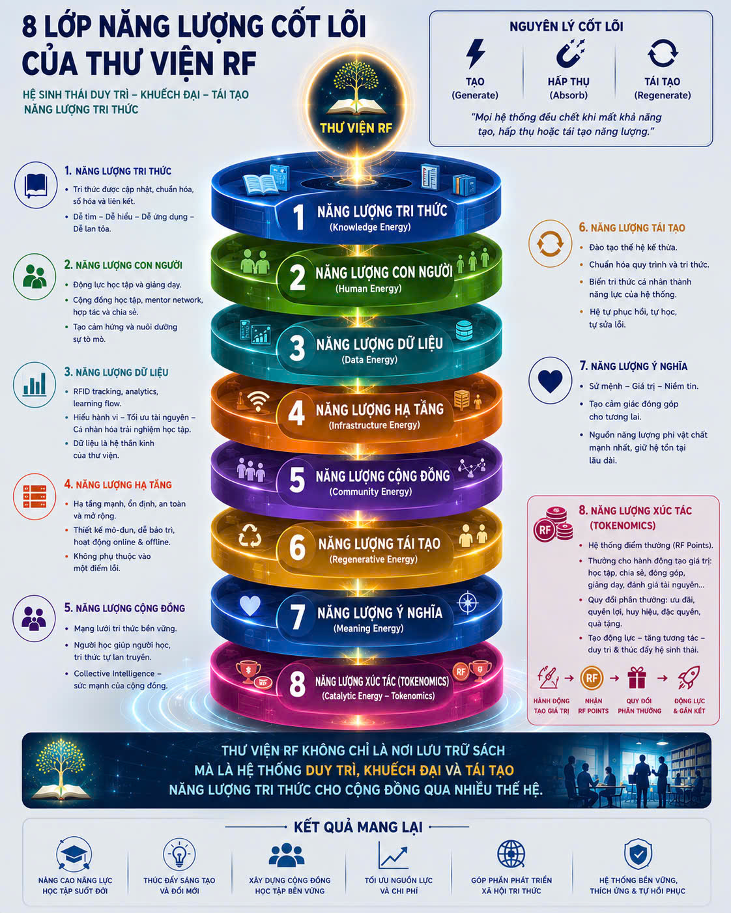

## Triết lý Hệ thống & Kiến trúc 8 Lớp Năng Lượng (Core Energy Architecture)

Dự án **Thư viện RF** không đơn thuần là một kho chứa tài liệu tĩnh, mà được định hình như một **Hệ sinh thái duy trì, khuếch đại và tái tạo năng lượng tri thức** xuyên thế hệ. Kiến trúc toàn hệ thống vận hành dựa trên nguyên lý cốt lõi: *"Mọi hệ thống đều chết khi mất khả năng tạo, hấp thụ hoặc tái tạo năng lượng."*

Meta Repo này đóng vai trò là khung kiến trúc thượng tầng, điều phối, tích hợp và chuẩn hóa 8 lớp năng lượng đan xen sau đây:

### 1. Năng Lượng Tri Thức (Knowledge Energy) — *Hạt nhân hệ thống*
* **Mô tả:** Luồng tri thức nền tảng được cập nhật, chuẩn hóa, số hóa và liên kết liên tục.
* **Tiêu chí kỹ thuật:** Đáp ứng triệt để nguyên tắc cấu trúc: *Dễ tìm - Dễ hiểu - Dễ ứng dụng - Dễ lan tỏa*.
* **Vai trò trong Repo:** Định hình các schema dữ liệu, tiêu chuẩn đóng gói tài liệu và các module tri thức cốt lõi.

### 2. Năng Lượng Con Người (Human Energy) — *Động cơ thúc đẩy*
* **Mô tả:** Nguồn năng lượng sinh ra từ động lực học tập của thành viên và tâm huyết giảng dạy của đội ngũ chuyên gia, cố vấn.
* **Cơ chế:** Khơi dậy sự tò mò cá nhân, thiết lập mạng lưới cố vấn (mentor network) để tối ưu hóa và liên tục duy trì sự tương tác, hợp tác, chia sẻ.

### 3. Năng Lượng Dữ Liệu (Data Energy) — *Hệ thần kinh điều phối*
* **Mô tả:** Hệ thống giám sát, phân tích luồng học tập (Learning Flow Analytics) và định danh tự động thông qua công nghệ RFID/IoT.
* **Cơ chế:** Thu thập dữ liệu hành vi thực tế nhằm tối ưu hóa việc phân bổ tài nguyên, loại bỏ lãng phí và cá nhân hóa sâu sắc lộ trình phát triển của từng thành viên.

### 4. Năng Lượng Hạ Tầng (Infrastructure Energy) — *Nền tảng vận hành*
* **Mô tả:** Hệ thống phần cứng, cấu trúc phần mềm và không gian vật lý được thiết kế theo tư duy mô-đun hóa, đảm bảo tính sẵn sàng cao.
* **Tiêu chí kỹ thuật:** Vận hành linh hoạt, đồng bộ và ổn định giữa hai trạng thái Online & Offline.
    * Kiến trúc loại bỏ điểm lỗi duy nhất (No Single Point of Failure) để dễ dàng bảo trì và mở rộng.
    * Tối ưu hóa tài nguyên năng lượng (ưu tiên giải pháp năng lượng sạch như hệ thống điện mặt trời hòa lưới nhằm tối giảm chi phí lưu trữ bình điện và đơn giản hóa vận hành).

### 5. Năng Lượng Cộng Đồng (Community Energy) — *Lực lượng khuếch đại*
* **Mô tả:** Mạng lưới liên kết bền vững giữa các thành viên theo mô hình Trí tuệ tập thể (Collective Intelligence).
* **Cơ chế:** Áp dụng nguyên lý lan truyền tự nhiên: người học trước dẫn dắt người học sau, biến cộng đồng thành một thực thể tự khuếch đại sức mạnh tri thức.

### 6. Năng Lượng Tái Tạo (Regenerative Energy) — *Khả năng thích ứng & Trường tồn*
* **Mô tả:** Quy trình đào tạo thế hệ kế thừa, chuẩn hóa các bước vận hành và chuyển hóa tri thức cá nhân thành năng lực cốt lõi của toàn hệ thống.
* **Đặc tính kiến trúc:** Tích hợp mô hình Trí tuệ thích ứng (Adaptive Intelligence) – cấu trúc tự học, tự phục hồi và tự sửa lỗi theo thời gian để hệ thống không bị lạc hậu trước sự thay đổi của công nghệ.

### 7. Năng Lượng Ý Nghĩa (Meaning Energy) — *Lực hấp dẫn cốt lõi*
* **Mô tả:** Giá trị cốt lõi, sứ mệnh xã hội và niềm tin chung vào tương lai.
* **Cơ chế:** Đóng vai trò là sợi dây liên kết phi vật chất mạnh mẽ nhất, định hình ý chí, đạo đức hệ thống và giữ chân các nguồn lực chất lượng cao gắn bó lâu dài.

### 8. Năng Lượng Xúc Tác (Catalytic Energy / Tokenomics) — *Vòng lặp động lực*
* **Mô tả:** Cơ chế kinh tế số dựa trên hệ thống điểm thưởng (RF Points) để ghi nhận và thúc đẩy các hành động tạo ra giá trị.
* **Vòng lặp vận hành:** **Hành động tạo giá trị** (Học tập, giảng dạy, chia sẻ) ➔ **Nhận RF Points** ➔ **Quy đổi đặc quyền/phần thưởng** ➔ **Tái tạo động lực & Gắn kết**

---

### Sơ đồ Khung Kiến trúc (System Topology)

*Mô hình hệ sinh thái duy trì, khuếch đại và tái tạo năng lượng tri thức của Thư viện RF.*

---

### Kết Quả Kỳ Vọng Hệ Thống (System Outcomes)

Sự chuyển hóa phối hợp nhịp nhàng giữa 8 lớp năng lượng hướng tới các mục tiêu:
* **Nâng cao năng lực học tập suốt đời:** Tạo môi trường chủ động, kích thích tư duy đổi mới.
* **Xây dựng cộng đồng bền vững:** Phát triển xã hội tri thức thu nhỏ có tính gắn kết cao.
* **Tối ưu hóa nguồn lực và chi phí:** Vận hành thông minh dựa trên dữ liệu hạ tầng mô-đun.
* **Hệ thống tự hồi phục và thích ứng:** Sẵn sàng tự điều chỉnh linh hoạt trước mọi biến động thực tế.