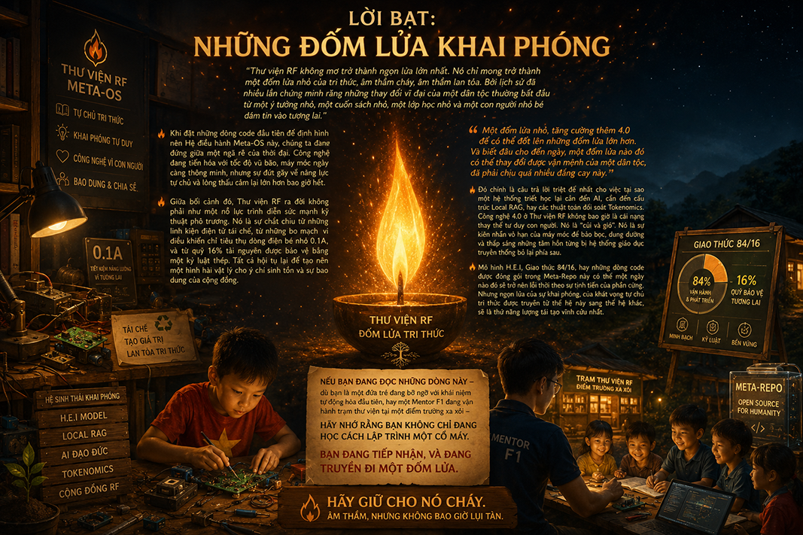

# 🕯️ Lời Bạt: Những Đốm Lửa Khai Phóng

> *"Thư viện RF không mơ trở thành ngọn lửa lớn nhất. Nó chỉ mong trở thành một đốm lửa nhỏ của tri thức, âm thầm cháy, âm thầm lan tỏa. Bởi lịch sử đã nhiều lần chứng minh rằng những thay đổi vĩ đại của một dân tộc thường bắt đầu từ một ý tưởng nhỏ, một cuốn sách nhỏ, một lớp học nhỏ và một con người nhỏ bé dám tin vào tương lai."*

Khi đặt những dòng code đầu tiên để định hình nên Hệ điều hành Meta-OS này, chúng ta đang đứng giữa một ngã rẽ của thời đại. Công nghệ đang tiến hóa với tốc độ vũ bão, máy móc ngày càng thông minh, nhưng sự đứt gãy về năng lực tự chủ và lòng thấu cảm lại lớn hơn bao giờ hết.

Giữa bối cảnh đó, Thư viện RF ra đời không phải như một nỗ lực trình diễn sức mạnh kỹ thuật phô trương. Nó là sự chắt chiu từ những linh kiện điện tử tái chế, từ những bo mạch vi điều khiển chỉ tiêu thụ dòng điện bé nhỏ 0.1A, và từ quỹ 16% tài nguyên được bảo vệ bằng một kỷ luật thép. Tất cả hội tụ lại để tạo nên một hình hài vật lý cho ý chí sinh tồn và sự bao dung của cộng đồng.

> *"Một đốm lửa nhỏ, tăng cường thêm 4.0 để có thể đốt lên những đốm lửa lớn hơn. Và biết đâu cho đến ngày, một đốm lửa nào đó có thể thay đổi được vận mệnh của một dân tộc, đã phải chịu quá nhiều đắng cay này."*

Đó chính là câu trả lời triệt để nhất cho việc tại sao một hệ thống triết học lại cần đến AI, cần đến cấu trúc Local RAG, hay các thuật toán đối soát Tokenomics. Công nghệ 4.0 ở Thư viện RF không bao giờ là cái nạng thay thế tư duy con người. Nó là "củi và gió". Nó là sự kiên nhẫn vô hạn của máy móc để bảo bọc, dung dưỡng và thắp sáng những tâm hồn từng bị hệ thống giáo dục truyền thống bỏ lại phía sau. 

Mô hình H.E.I, Giao thức 84/16, hay những dòng code được đóng gói trong Meta-Repo này có thể một ngày nào đó sẽ trở nên lỗi thời theo sự tịnh tiến của phần cứng. Nhưng ngọn lửa của sự khai phóng, của khát vọng tự chủ tri thức được truyền từ thế hệ này sang thế hệ khác, sẽ là thứ năng lượng tái tạo vĩnh cửu nhất.

Nếu bạn đang đọc những dòng này — dù bạn là một đứa trẻ đang bỡ ngỡ với khái niệm tự động hóa đầu tiên, hay một Mentor F1 đang vận hành trạm thư viện tại một điểm trường xa xôi — hãy nhớ rằng bạn không chỉ đang học cách lập trình một cỗ máy. 

Bạn đang tiếp nhận, và đang truyền đi một đốm lửa. 

Hãy giữ cho nó cháy. Âm thầm, nhưng không bao giờ lụi tàn...

