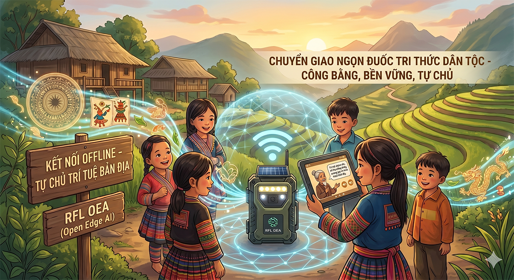

# 🏛️ Lời Hiệu Triệu: Ranh Giới Của Sự Khai Phóng

> *"Chúng ta từng coi việc bất kỳ ai cũng có thể truy cập vào kho tàng tri thức thế giới thông qua một đường truyền Internet là đỉnh cao của sự tiến bộ. Nhưng thực tế, chuẩn mực đó vẫn đang bỏ lại hàng triệu thế hệ tương lai ở những vùng lõm sóng và nghèo nàn về công nghệ.*
>
> *RFL OEA (OpenEdgeAI) ra đời để định nghĩa lại ranh giới đó.*
>
> *Bằng cách ứng dụng hạ tầng trí tuệ biên mã nguồn mở, chúng tôi không chỉ mang tri thức đến cho thế hệ sau, mà là trao cho các em một trí tuệ sống động, có khả năng tương tác và thấu hiểu bản địa ngay tại chỗ. Đây không chỉ là một giải pháp công nghệ; đây là lời cam kết của chúng tôi trong việc đóng gói và trao truyền ngọn đuốc tri thức dân tộc cho thế hệ mai sau một cách công bằng, bền vững và tự chủ nhất."*
>
> — **RFL President / Kiến trúc sư trưởng**

