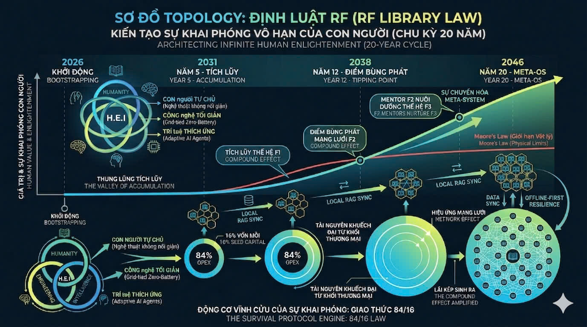

# Đo Lường Tác Động Xã Hội & Lợi Tức Hệ Sinh Thái (Social ROI)

> *"Mọi hệ thống kinh tế truyền thống đều đi đến điểm trần vật lý của tài nguyên. Định luật RF ra đời để phá vỡ giới hạn đó bằng cơ chế tự tái tạo nguồn lực liên thế hệ. Định luật Moore dự đoán giới hạn của phần cứng máy tính, còn Định luật RF kiến tạo sự khai phóng vô hạn của con người."*

---

## 1. Bản chất của Định luật RF: Hiệu ứng Lãi kép Meta-OS
Định luật RF thực chất là **Hiệu ứng Lãi kép (The Compound Effect)**, nhưng được nâng cấp từ cấp độ cá nhân lên cấp độ hệ sinh thái kết hợp với Hiệu ứng Mạng lưới (Network Effect). 

Trong phát triển cá nhân, toán học của sự tiến bộ 1% mỗi ngày được biểu diễn qua công thức: $1.01^{365} \approx 37.78$. Định luật RF mang chính DNA này nhưng áp dụng cho tài nguyên: **1% nỗ lực của cá nhân tương đương với 16% quỹ duy trì của hệ thống.**

Sự khai phóng này được biểu diễn qua công thức Lãi kép Cộng đồng:
$$V_t = V_0(1 + r)^t$$

*Trong đó:*
* **$V_t$**: Giá trị tổng thể của hệ sinh thái ở năm thứ $t$.
* **$V_0$**: Giá trị khởi điểm (Vốn mồi từ hạ tầng 84% và tri thức ban đầu).
* **$t$**: Chu kỳ thời gian.
* **$r$**: Tỷ lệ chuyển hóa ngược (Số lượng học viên từ khối 16% trưởng thành và quay lại cống hiến dưới dạng Mentor hoặc nhà tài trợ).

Sự khác biệt vươn tầm của Định luật RF nằm ở **Tính Kế thừa chéo (Cross-Compounding)**. Nếu con người dừng lại, chuỗi lãi kép cá nhân sẽ đứt gãy. Nhưng trong Meta-OS, quá trình này được ép buộc bằng thuật toán: Một học viên giỏi lên tạo ra *Năng lượng Con người* (Mentor), hệ AI học từ họ tạo ra *Năng lượng Tri thức*, và phân phối ngay lập tức qua *Năng lượng Hạ tầng*. Lãi kép sinh ra Lãi kép liên tục thành một động cơ vĩnh cửu.

---

## 2. Ba Trụ cột Vận hành của Định luật RF

### A. Cơ chế Lãi kép của Năng lượng Con người (Compound Human Energy)
Trong kinh tế học truyền thống, chi phí cho hoạt động phi lợi nhuận (16%) bị xem là chi phí tiêu hao (Sunk Cost). Trong hệ thống H.E.I, đây là **Vốn mồi (Seed Capital)**.
16% của năm thứ 10 không chỉ là tài nguyên vật lý, mà nó bao hàm cả chất xám của những học viên đã thành tài từ năm thứ 1 đến năm thứ 9. Khi họ đạt đến các cấp độ tư duy thực chiến (Mastering AI Agents, System Integration), họ quay lại hệ thống, khiến giá trị của 16% tự động nhân lên gấp nhiều lần.

### B. Định luật "Tỷ lệ nghịch" của Trí tuệ Thích ứng (Adaptive Intelligence)
Định luật Moore làm cho phần cứng rẻ đi. Định luật RF làm cho **chi phí vận hành tri thức rẻ đi**.
* **Giai đoạn đầu:** Khối 84% phải gồng gánh chi phí vật lý (xây trạm, R&D cơ khí).
* **Giai đoạn trưởng thành:** Nhờ Trí tuệ Thích ứng tự học và tối ưu, kết hợp hạ tầng năng lượng hòa lưới (Grid-tied) loại bỏ chi phí thay pin, OPEX của khối 84% tiệm cận về 0.
* **Hệ quả:** Toàn bộ băng thông, năng lượng và dòng tiền thặng dư tạo ra áp lực khổng lồ đẩy ngược sang khối 16%, đủ sức bao phủ giáo dục cho cả một quốc gia.

### C. Hiệu ứng Khuếch đại của Tổ ong (The Hive Expansion)
Nếu Moore nói về việc nhét thêm linh kiện vào một con chip, thì RF Law nói về việc nhân bản các điểm nút (Edge Nodes).
Khi một học viên tại trạm Lâm Đồng giải được bài toán về điều khiển robot nông nghiệp, hệ thống RAG cục bộ đồng bộ hóa tri thức này lên Cloud và phân phối xuống trạm Vĩnh Long chỉ trong vài giây. Giá trị ý nghĩa (Meaning Energy) của một hành động được khuếch đại $n$ lần dựa trên số lượng trạm.

---

## 3. Bức tranh 20 Năm của Định luật RF (2026 - 2046)

### Giai đoạn 1: Thung lũng Tích lũy (Năm 1 - 5)
* **Trạng thái:** Bootstrapping (Khởi động).
* **Vận hành:** Hệ thống đi qua "Thung lũng của sự thất vọng". Dòng tiền 16% dường như biến mất vào việc đào tạo lứa học viên F1. ROI vật lý tăng rất chậm. Tuy nhiên, đây là giai đoạn **Nén Năng Lượng**, khối 84% chật vật duy trì để khối 16% tạo ra những Proof of Concept đầu tiên.

### Giai đoạn 2: Điểm Bùng phát (Năm 5 - 12)
* **Trạng thái:** Tipping Point.
* **Vận hành:** Học viên thế hệ F1 trở thành Mentor (F2). Tỷ lệ đóng góp ngược ($r$) tăng mạnh. Đồ thị tác động dựng đứng theo chiều thẳng đứng khi Năng lượng Tri thức và Năng lượng Con người giao thoa.

### Giai đoạn 3: Sự Chuyển hóa Mạng lưới (Năm 12 - 20)
* **Trạng thái:** Meta-System (Trạng thái Trường tồn).
* **Vận hành:** Thư viện RF không còn là các container vật lý, mà trở thành một siêu cấu trúc có khả năng tự chẩn đoán, tự phân bổ 84/16 theo thời gian thực nhờ lõi AI.

---

## 4. Lời Cam Kết Với Nhà Đầu Tư & Đối Tác
Khoản đầu tư CSR vào Thư viện RF không bị tiêu sản. Nó được bơm vào một **Động cơ Vĩnh cửu**, liên tục tự tái tạo dòng tiền để sinh ra các thế hệ kỹ sư chất lượng cao phục vụ chính chuỗi cung ứng toàn cầu của bạn.